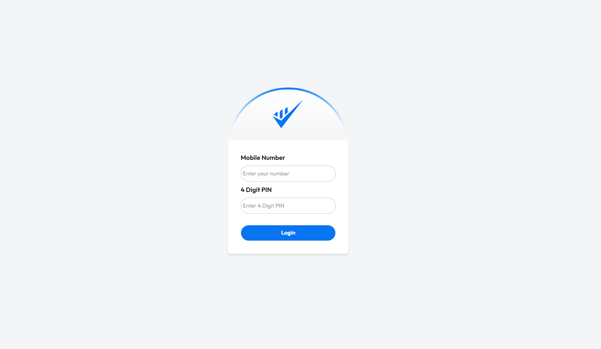

# 📱 Payoo Mobile Bank

Payoo Mobile Bank is a **frontend web application** that simulates a simple **mobile banking system**. It allows users to **log in, manage balance, add money, cash out, transfer money, pay bills and view transaction history** in a clean and interactive UI.

---

## 🌟 Features

- 🔑 **Login System** (with fixed demo credentials)  
- 💰 **Add Money** from different banks  
- 💸 **Cash Out** with PIN verification  
- 🔄 **Transfer Money** between accounts  
- 🎁 **Get Bonus** using a coupon code  
- 🧾 **Pay Bills** (utility-style form)  
- 📊 **Transaction History** (real-time transaction logging)  
- 🎨 **Responsive UI** using TailwindCSS + DaisyUI  
- ⚡ **Reusable Functions** for input handling and transaction updates  
- ⚡ **Active Buttons** for keeping track of the section  

---

## 🛠️ Tech Stack

- **HTML5**  
- **CSS3 / TailwindCSS**  
- **DaisyUI**  
- **Font Awesome** (icons)  
- **JavaScript (ES6)**  

---

## 🚀 Getting Started

### 1️⃣ Clone the Repository

```bash

git clone https://github.com/your-username/payoo-mobile-bank.git
cd payoo-mobile-bank

```

### 2️⃣ Open the Project

Just open index.html in your browser.
No server setup required ✅.

## 🔑 Demo Login Credentials
-------------------------
| Mobile Number |	PIN |
| 12345	        | 1234  |
-------------------------

---

## 📂 Project Structure

```bash

payoo-mobile-bank/
│
├── index.html          # Login page
├── script.js           # Login validation logic
│
├── home.html           # Main dashboard page
├── home.js             # Core banking features (transactions, balance, etc.)
│
├── styles/
│   └── style.css       # Custom styles
│
└── assets/             # Logos, icons, background images
```

## 📸 Screenshots

### 👉Login Page


### 👉Dashboard


### 👉Transaction History


## 📌 Future Improvements

✅ Add real backend integration with Node.js/Express

✅ Store transaction history in localStorage or DB

✅ Implement JWT authentication

✅ Add dynamic users & accounts

---

## 👨‍💻 Author

Developed with ❤️ by **TAOSHIFLEX**


---
