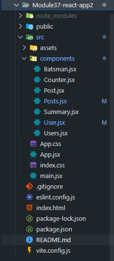
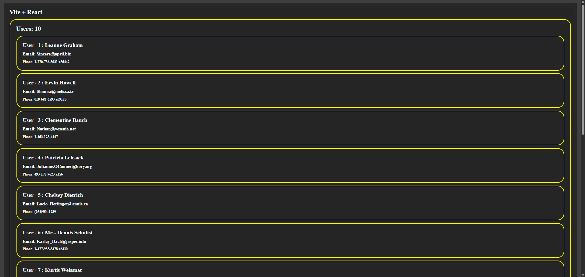
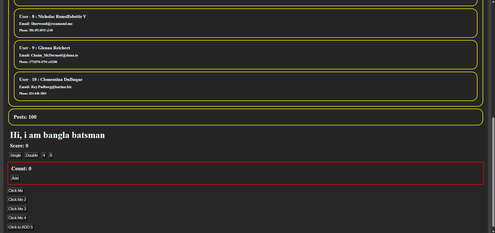

# 🚀 Module 37: React App 2 - Core Concepts and Data Fetching

This project is a React application built with **Vite**, focusing on key React concepts including **component creation**, **state management (`useState`)**, **event handling**, and modern data fetching using **Suspense** and the **`use()` hook**.

---

## ✨ Key Features Implemented

This application demonstrates several core capabilities of a React application:

### 1. Dynamic Data Fetching (Suspense & `use` Hook)

* **Users List:** Fetched **10 user records** from the `jsonplaceholder.typicode.com/users` API.
* **Modern Fetching:** Utilizes the modern **`use()` hook** combined with the `<Suspense>` boundary to manage the loading state, providing a smooth user experience.
* **Posts:** Implemented logic to fetch 100 post records from the API, which is currently commented out in the main component for a cleaner initial display.

### 2. Interactive Components & State Management

* **`Counter` Component:** A fully functional counter with an **Add** button, demonstrating basic `useState` functionality.
* **`Batsman` Component:** A specialized component simulating a batsman's score.
    * Buttons for **Single**, **Double**, **4**, and **6** update the total score.
    * Includes a conditional rendering feature that **congratulates the user** when the score exceeds 50!

### 3. Diverse Event Handling

The app showcases five different methods for handling button clicks in React:

1.  **Normal Function:** (`handleClick`)
2.  **Arrow Function:** (`handleClick3`)
3.  **Anonymous Function in `onClick`:** (`handleClick2`)
4.  **Inline Arrow Function in `onClick`:** (Click Me 4)
5.  **Passing Arguments via Arrow Function:** (Click to ADD 5, which adds 5 to a fixed number 9 and shows the result in an alert).

---

## 📁 Project Structure

The structure is clean and component-driven:



---

## 🖼️ Application Screenshots

### 1. Users List Display
Shows the 10 fetched users rendered as individual cards with contact details. (See attached image)

### 2. Interactive Features
Shows the "Batsman" score section, the "Counter" component, and all the functional click-handling buttons. (See attached image)

---

## ⚙️ Setup and Run

To run this project locally:

1.  **Clone the repository:**

    ```bash
    git clone [your-repo-link]
    ```

2.  **Navigate to the project directory:**

    ```bash
    cd Module37-react-app2
    ```

3.  **Install dependencies:**

    ```bash
    npm install
    ```

4.  **Start the development server:**

    ```bash
    npm run dev
    ```

The application will typically open at `http://localhost:5173`.

Enjoy the app! 🎉    

## SS

