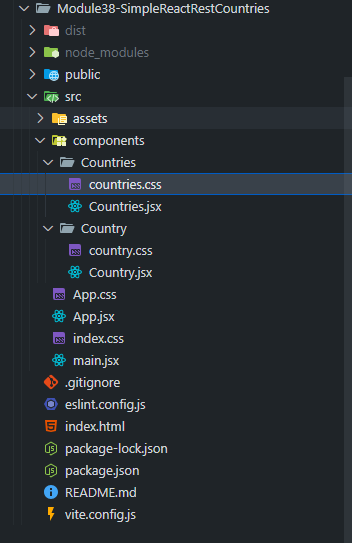
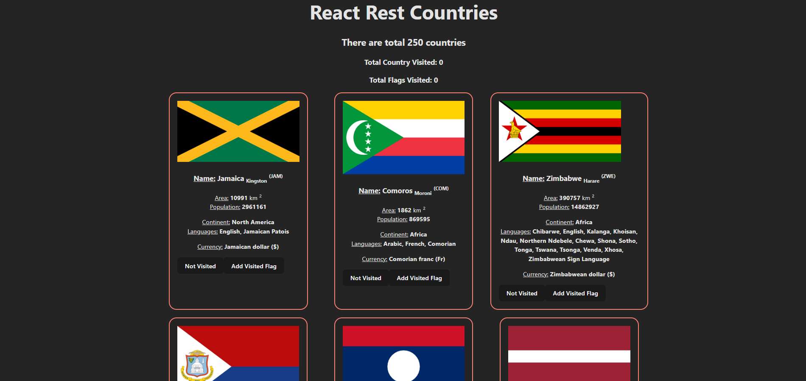
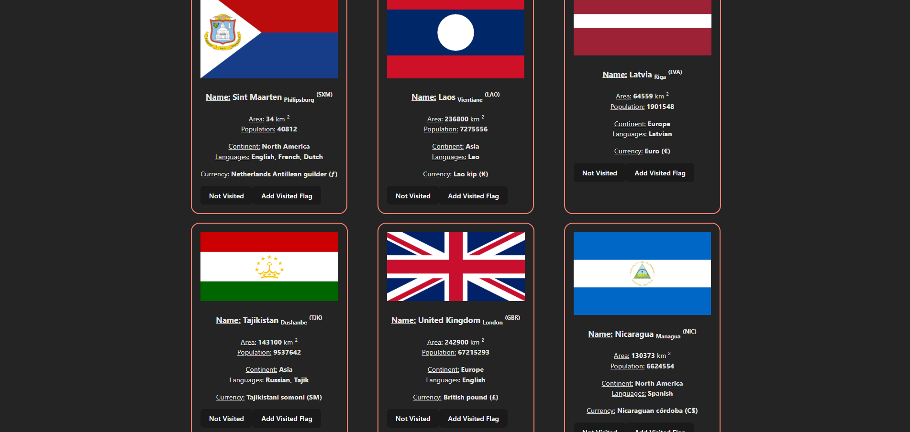

# 🌍 Simple React REST Countries API

> ⚠️ **Note:** This is a **paid/private project** — **not open-source** and **not licensed under MIT**.  
> Redistribution, reuse, or commercial use without permission is **strictly prohibited**.

---

A **React-based project** built during **Module 38**, demonstrating data fetching, state management, and dynamic rendering using the **REST Countries API** from `Programming Hero OpenAPI`.

This project displays all countries, allows marking them as **visited**, and dynamically tracks **visited flags** and **visited country counts**.

---

### 🚀 Live Demo
👉 **[simplereactrestcountries.netlify.app/](https://simplereactrestcountries.netlify.app/)**

---

## 🧠 Project Overview

This app fetches country data using React’s experimental `use()` hook (Suspense), then displays each country with key details such as:

- Flag 🇧🇩  
- Name, Capital, Continent  
- Area, Population, Language(s), and Currency  
- Buttons to mark countries as **Visited** and to **Add Visited Flag**

It’s a **modular, component-driven React app** — clean, efficient, and scalable.

---

## 🗂️ Project Structure



---

## ⚙️ Core Features

✅ Fetches country data using the REST Countries API  
✅ Uses React’s `use()` hook for suspenseful data loading  
✅ Tracks **visited countries** and **visited flags** dynamically  
✅ Fully responsive with CSS Grid layout  
✅ Clean component-based architecture  

---

## 🌐 API Endpoints Used

| Endpoint | Purpose |
|-----------|----------|
| `/api/all` | Fetch all countries |
| `/api/alpha/{code}` | Fetch a country by ISO alpha code |
| `/api/lang/{language}` | Fetch countries by language |
| `/api/name/{name}` | Fetch countries by name |

**Example Base URL:**  
`https://openapi.programming-hero.com/api/`

---

## 🧩 Example Usage (JavaScript Fetch)

```js
// Fetch all countries
fetch("https://openapi.programming-hero.com/api/all")
  .then(res => res.json())
  .then(data => console.log(data));

// Fetch by ISO alpha code
fetch("https://openapi.programming-hero.com/api/alpha/116")
  .then(res => res.json())
  .then(data => console.log(data));
```
---

## 🧱 Components Breakdown

### 🧭 Countries.jsx

---

- Fetches data via use(countriesPromise)

- Manages:

  - visitedCountries (state)

  - visitedFlags (state)

- Displays total visited count & flag gallery

- Maps through countries to render <Country /> components

---

### 🗺️ Country.jsx

- Displays:

  - Name, Flag, Capital, Area, Population, Continent, Languages, Currency

- Local visited state toggled via button

- Sends selected country & flag data back to parent component

- Dynamically styled using conditional class (country-visited)

---

## 🎨 Styling Overview

### countries.css

- Responsive CSS Grid layout (3 → 2 → 1 column)

- Centered headings

- Scrollable flag container

---

### country.css

- Bordered, rounded country cards

- Subtle hover effects

- Background color changes on “Visited”

- Center-aligned text and elements

---

## ⚡ Getting Started

### 1️⃣ Clone the Repository

```bash

git clone https://github.com/your-username/simple-react-rest-countries.git
cd simple-react-rest-countries

```

### 2️⃣ Install Dependencies
```bash
npm install
```

### 3️⃣ Run Locally
```bash
npm run dev
```

### 4️⃣ Open in Browser
```bash
👉 http://localhost:5173/
```
---

## 🧾 Example API Response

### `/api/all`

```json
[
  {
    "name": "Afghanistan",
    "alpha2Code": "AF",
    "alpha3Code": "AFG",
    "capital": "Kabul",
    "region": "Asia",
    "population": 40218234
  },
  {
    "name": "Albania",
    "alpha2Code": "AL",
    "alpha3Code": "ALB",
    "capital": "Tirana",
    "region": "Europe",
    "population": 2877797
  }
]
```

### `/api/name/bangladesh`

```json
[
  {
    "name": "Bangladesh",
    "alpha2Code": "BD",
    "alpha3Code": "BGD",
    "capital": "Dhaka",
    "region": "Asia",
    "population": 169356251
  }
]

```

---

## 🧑‍💻 Tech Stack

- ⚛️ React 18 (Vite)

- 🎨 CSS3 (Responsive Grid Layout)

- 🌐 Programming Hero REST API

- 💡 JavaScript (ES6+)

---

## 💡 Lessons Learned

- Handling asynchronous data with React Suspense

- Parent ↔ Child component communication

- Managing multiple dynamic states

- Designing with responsive CSS Grid

- Creating interactive and visual data experiences

--- 

### 🌟 Credits

#### 👨‍💻 Developed by Taoshiflex
#### 🎓 CSE Student @ East West University, Dhaka
#### 💼 Exploring the intersection of Tech × Business × Creativity


---

## SS


