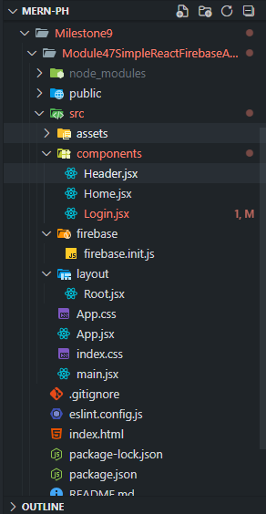
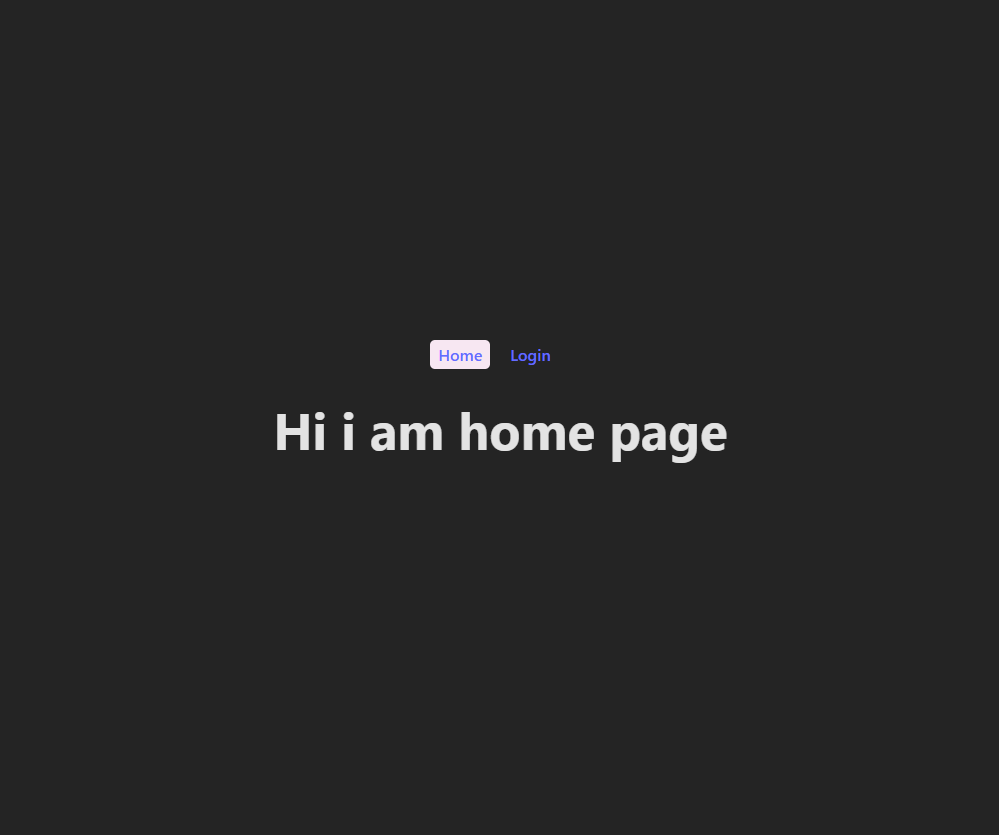
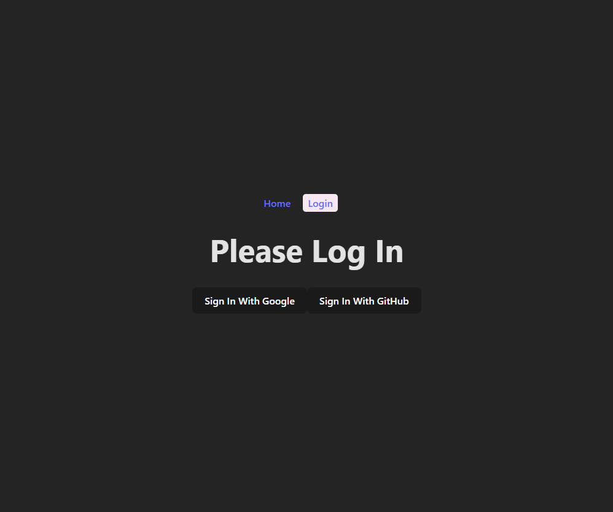
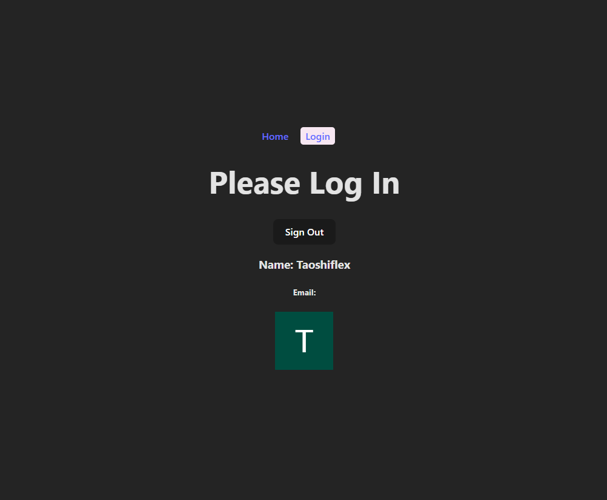

# 🔑 Simple React Firebase Authentication Project

 A **React + Firebase Authentication** project built during **Module 47** of the MERN Stack course. This project demonstrates the fundamental setup for **Client-Side Authentication** in a React Single Page Application (SPA).This module is focued on Firebase Authentication integration into a React Single Page Application (SPA) using **React Router**, **Google**, and **GitHub** sign-in methods. 🚀

## 🚀 Key Features

* **React Router v6:** Utilizes `RouterProvider`, `createBrowserRouter`, and the `<Outlet />` component for defining the main application layout and navigation.
* **Firebase Initialization:** Sets up the core Firebase app and imports the `auth` service.
* **Social Sign-In:** Implements sign-in functionality using:
    * **Google Popup Authentication**
    * **GitHub Popup Authentication** (with explicit request for email scope).
* **User State Management:** Manages the logged-in user's state (`user` object) using React's `useState` hook.
* **Sign Out:** Implements the `signOut` function to clear the user session.
* **Conditional Rendering:** Dynamically displays the user's profile information (Name, Email, Photo) or the login buttons based on the current authentication status.

## 🧠 Learning Objectives

- Integrate **Firebase Authentication** into a React app.  
- Configure **Google** and **GitHub** OAuth providers.  
- Implement **Sign-In** and **Sign-Out** functionality.  
- Manage **user state** dynamically with React hooks.  
- Route between pages using **React Router v7**.  

---

## 🛠️ Technology Stack

| Technology | Role |
| :--- | :--- |
| **React** | Core component-based UI library. |
| **Vite** | Fast development server and build tool. |
| **Firebase** | Backend-as-a-Service (BaaS) for Authentication. |
| **react-router** | Declarative routing for React SPAs. |

---

# 🧩 Core Files Overview

## 🏠 Home.jsx

- Simple landing page rendered at the root (/) route.

## 🔐 Login.jsx

- Implements:

    - Google Sign-In

    - GitHub Sign-In

    - Sign-Out

    - Displays logged-in user info (name, email, profile photo)

## 🧭 Header.jsx

- Provides navigation links for **Home** and **Login** using `NavLink` from React Router.

## 🌍 Root.jsx

- Parent layout file containing `<Header />` and `<Outlet />` for nested routing.

## 🪄 main.jsx

- Configures `createBrowserRouter` and injects routes via `RouterProvider`.

--- 

# 🧠 Key Concepts Learned

- Using Firebase SDK to initialize and authenticate users.

- Handling OAuth pop-ups and promise chains.

- Managing user state via useState().

- Implementing conditional rendering (sign-in vs sign-out UI).

- Applying React Router nested routes (Root, Home, Login).

---

## ⚙️ Project Setup

### 1. **Clone the Repository**

```bash
git clone <your-repo-link>
cd Module47SimpleReactFirebaseAuth
```

2. Install Dependencies

Install the necessary packages defined in package.json:

```bash
npm install
# or
yarn install
```

3. Configure Firebase

🚨 IMPORTANT SECURITY NOTE: Never commit your actual Firebase API keys directly to a public repository like this. For this basic project, the keys are included in src/firebase/firebase.init.js as an initial setup, but in production, these must be stored securely using environment variables (e.g., VITE_FIREBASE_API_KEY in a .env file).

### To run the project locally, you must:

1. Create a new Firebase project in the Firebase Console.

2. Enable the Google and GitHub sign-in providers under the Authentication section.

3. Replace the placeholder firebaseConfig object in src/firebase/firebase.init.js with your project's actual configuration object.

4. Run the Project

Start the development server:

```bash
npm run dev
# or
yarn dev
```

The application will typically open at http://localhost:5173.

📁 Project Structure


## 💡 Learning Takeaways

- Successfully integrated Firebase Authentication into a React component using signInWithPopup.

- Handled promises (.then().catch()) for asynchronous sign-in operations.

- Learned the importance of providing email scope for providers like GitHub to retrieve the user's email address.

- Established a clean routing structure using Root Layouts in react-router.

---
# 👨‍💻 Author

## Taoshiflex
### 📍 East West University, Dhaka
### 🧠 MERN Stack Developer in progress | Entrepreneur | Visionary

---

# “Every line of code is a small step toward mastery.” — Taoshiflex 💫

---

# SS -


