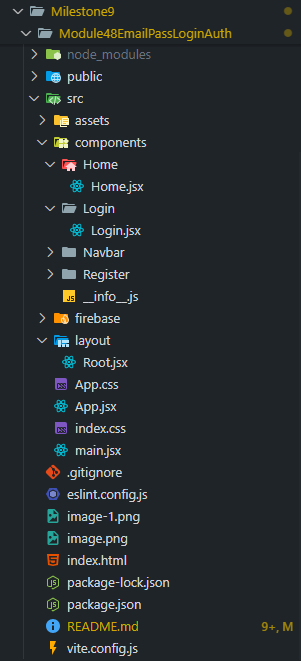
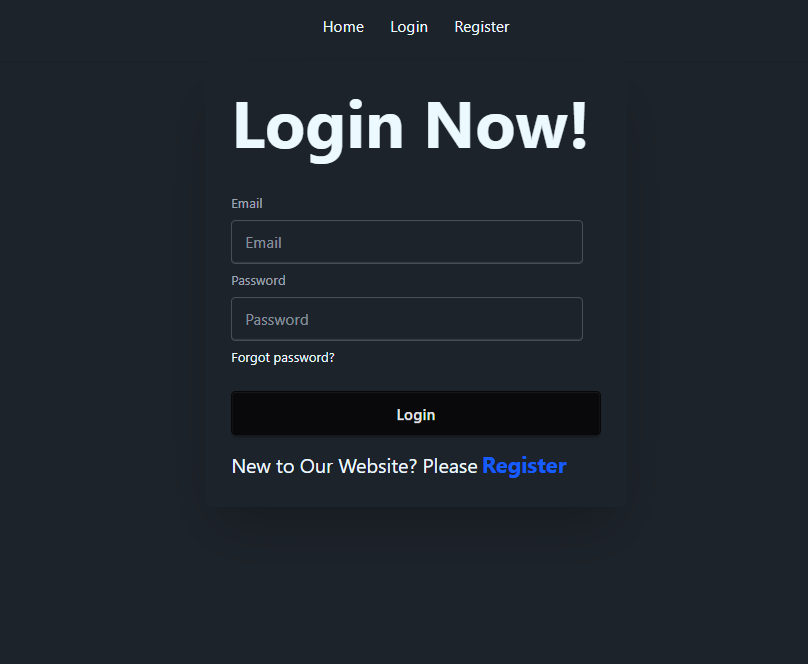

# 🔐 React Firebase Email/Password Authentication

A React + Vite web app featuring Firebase Authentication using Email & Password.
Users can register, verify email, log in, reset password and manage sessions easily — all built from scratch with modern tools like TailwindCSS, DaisyUI and React Router v7.

---

# 🧠 Project Overview

This project demonstrates:

- ✅ Firebase Email/Password Authentication

- 🔑 Registration with email verification

- 🔁 Login with validation

- 🔐 Password reset functionality

- 🧩 Routing with React Router

- 🎨 Styling using TailwindCSS + DaisyUI

- ⚙️ Project setup with Vite + React 19

---

# ⚡ Tech Stack

* **Frontend:** React
* **Styling:** Tailwind CSS, DaisyUI
* **Routing:** React Router DOM
* **Authentication:** Google Firebase
* **Build Tool:** Vite
* **Icon Pack:** React Icons
* **Prebuilt UI Components:** DaisyUI

---

# 🧩 Folder Structure


---

# 🚀 Installation & Setup

Follow these steps to run the project locally 👇

1️⃣ Clone the repository

```bash
git clone https://github.com/yourusername/module48emailpassloginauth.git
cd module48emailpassloginauth
```

2️⃣ Install dependencies

```bash
npm install
```

3️⃣ Setup Firebase

1. Go to Firebase Console

2. Create a new project

3. Add a Web App and copy its config

4. Enable Email/Password Authentication

5. Paste your config inside src/firebase/firebase.init.js

```js
const firebaseConfig = {
  apiKey: "YOUR_API_KEY",
  authDomain: "YOUR_AUTH_DOMAIN",
  projectId: "YOUR_PROJECT_ID",
  storageBucket: "YOUR_BUCKET",
  messagingSenderId: "YOUR_SENDER_ID",
  appId: "YOUR_APP_ID"
};
```

## ⚠️ Important: Never share your Firebase config publicly.

---


# 🧠 Key Features & Flow

## 📝 Register (Sign Up)

- Uses createUserWithEmailAndPassword(auth, email, password)

- Validates password using Regex:

    - Minimum 6 characters

    - At least one uppercase & one lowercase letter

    - At least one special character

- Sends email verification

- Displays success or error messages dynamically

## 🔓 Login

- Uses signInWithEmailAndPassword(auth, email, password)

- Prevents login if email isn’t verified

- Handles and displays errors gracefully

## 🔁 Forgot Password

- Uses sendPasswordResetEmail(auth, email)

- Sends reset link to the user’s registered email

## 🧭 Routing

Implemented via React Router v7:

- / → Home

- /register → Register Page

- /login → Login Page

- Global navigation handled via Navbar

--- 

# 🧱 Components Breakdown

Component	Description
Root.jsx	Parent layout containing Navbar and <Outlet /> for child routes
Navbar.jsx	Responsive navigation with NavLink
Register.jsx	Handles new user creation + validation + email verification
Login.jsx	Handles login + error handling + password reset
Home.jsx	Simple landing page
firebase.init.js	Initializes Firebase + exports auth
info.js	Documentation file for dev references

---

# ⚡ Scripts

Command	Description

```bash
npm run dev	        // Starts local dev server
npm run build	    // Builds for production
```

---

# 🧠 Concepts Learned

1. Firebase Project Setup

2. Enabling Email/Password Authentication

3. Email Verification Flow

4. Password Reset using Firebase

5. Regex-based Password Validation

6. Handling Auth Errors

7. Conditional Rendering in React

8. Router Setup with Nested Routes

---

# 📸 UI Preview 




---

# 💡 Future Improvements

- Protect routes using PrivateRoute

- Store user session in local storage

- Add logout functionality

- Display user profile information

---

# 🧑‍💻 Author

👤 Taoshiflex

💼 Founder of Taoshiflex Venture & Solution
📚 CSE Student | Entrepreneur | Lifelong Learner

---

# 📜 License

## This project is not open-source or MIT licensed. It’s built for personal learning and portfolio purposes only.