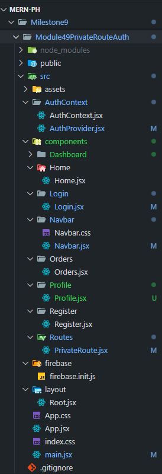

# 🔐 Private Route Auth (React + Firebase + Tailwind)

A **React Authentication project** built during **Milestone 9 (Module 49)**, demonstrating private routing, authentication state management and Google sign-in using **Firebase Authentication**.  
This project helps users understand how **private routes** work and how to protect pages based on login state using **React Context API** and **Firebase**.

---

## 🧠 Key Concepts

- Firebase Authentication (Email/Password + Google Sign-In)
- Private Routes (Route Protection)
- React Context API for Global Auth State
- Tailwind CSS + DaisyUI Styling
- React Router (v7)
- Vite for Fast Development

---

## 📂 Project Structure

The project follows a standard modular structure, emphasizing separation of concerns for Authentication logic and UI components.



---

## 🚀 Features

✅ **User Registration** with Firebase  
✅ **Email/Password Login**  
✅ **Google Sign-In Authentication**  
✅ **Protected Pages (PrivateRoute)**  
✅ **Navbar updates dynamically** based on login state  
✅ **React Context for Global Auth Management**  
✅ **Loading Spinner while fetching user data**  
✅ **Tailwind + DaisyUI** for fast, modern UI  

---

## ✨ Features Implemented

* **Context-Based Auth System:** Centralized state and authentication functions using **React Context** (`AuthContext.jsx` and `AuthProvider.jsx`).

* **Email/Password Authentication:** Functions for creating new users and signing in existing users.

* **Social Login:** **Google Sign-In** functionality using Firebase Popups.

* **Private Routing:** Secure pages like `/orders`, `/profile`, and `/dashboard` are protected using a dedicated **`<PrivateRoute>`** component.

* **Loading State:** Displays a loading spinner while checking the authentication status (`onAuthStateChanged`) to prevent content flicker.

* **Navigation & Redirection:** Users are redirected to the Login page when trying to access a private route, and then seamlessly redirected back to their intended page after successful login.

* **Logout Functionality:** Clear and reliable sign-out process.

* **Modern Hooks:** Utilizes `useContext` (via the experimental `use` hook) for clean state access and `useLocation`/`useNavigate` for routing logic.

* **Styling:** Modern, responsive UI with **Tailwind CSS** and **DaisyUI**.

---

## 🚀 Technologies Used

| Category | Technology | Purpose |
| :--- | :--- | :--- |
| **Frontend** | **Vite, React** | Fast build tool and UI library. |
| **State/Data** | **React Context** | Global state for user and authentication status. |
| **Routing** | **React Router DOM v6** | Client-side routing, including `Private` and `Public` paths. |
| **Backend/Auth**| **Firebase Authentication** | Handling user registration, login, and Google sign-in. |
| **Styling** | **Tailwind CSS, DaisyUI** | Utility-first CSS framework and component library. |

---

## ⚙️ Setup Instructions

### 1️⃣ Clone the Repository

```bash
git clone https://github.com/your-username/Private-Route-Auth.git
cd Private-Route-Auth
```

### 2️⃣ Install Dependencies

```bash
Copy code
npm install
```

### 3️⃣ Add Firebase Config

This project requires a Firebase project to run.

1. Create a Project: Go to the Firebase Console and create a new project.

2. Add a Web App: Register a new web app (</>) and copy your configuration.

3. Enable Auth Methods: In the Firebase Console, go to Authentication > Sign-in method and enable:

    - Email/Password

    - Google

4. Update Firebase.init.js: Paste your Firebase configuration into the src/firebase/Firebase.init.js file, replacing the existing placeholders.

    * ⚠️ SECURITY NOTE: The apiKey is exposed in a public file for simplicity. In a real production app, always use environment variables (e.g., .env file) to hide sensitive keys.

```js
const firebaseConfig = {
  apiKey: "YOUR_API_KEY",
  authDomain: "YOUR_PROJECT.firebaseapp.com",
  projectId: "YOUR_PROJECT_ID",
  storageBucket: "YOUR_PROJECT.appspot.com",
  messagingSenderId: "YOUR_SENDER_ID",
  appId: "YOUR_APP_ID"
};
```

### 4️⃣ Run the App

```bash
Copy code
npm run dev
Now open http://localhost:5173 to view it in your browser 🎯
```

---

## 🔐 Protected Routes

| Route        | Access Type | Description                       |
| ------------ | ----------- | --------------------------------- |
| `/`          | Public      | Homepage                          |
| `/login`     | Public      | Login Page                        |
| `/register`  | Public      | Register Page                     |
| `/orders`    | Private     | View orders (Login Required)      |
| `/profile`   | Private     | Update user profile               |
| `/dashboard` | Private     | Dashboard access for logged users |

---

## 🧩 Core Logic Overview

### 🧱 Component Breakdown

| File                 | Type      | Description                                                                     |
| :------------------- | :-------- | :------------------------------------------------------------------------------ |
| **Root.jsx**         | Layout    | Parent layout containing `<Navbar />` and `<Outlet />` for child routes.        |
| **Navbar.jsx**       | UI        | Responsive navigation bar built with **NavLink**, updates based on login state. |
| **Register.jsx**     | Component | Handles new user registration, validation, and Firebase email verification.     |
| **Login.jsx**        | Component | Manages login logic, error handling, and password reset flow.                   |
| **Home.jsx**         | Page      | Simple public landing page for all users.                                       |
| **PrivateRoute.jsx** | Logic     | Protects routes, ensuring only authenticated users can access certain pages.    |
| **AuthProvider.jsx** | Context   | Wraps the app with global authentication context using React’s Context API.     |
| **firebase.init.js** | Config    | Initializes Firebase and exports `auth` instance for use in the app.            |
| **info.js**          | Docs      | Developer reference file containing setup and configuration notes.              |

---

### 🔸 AuthProvider.jsx

Handles authentication and user state globally:

```js
const authInfo = {
  user,
  loading,
  createUser,
  signInUser,
  signInWithGoogle,
  signOutUser
};
```

### 🔸 PrivateRoute.jsx

Protects sensitive pages:

```jsx
if (loading) return <span className="loading loading-spinner text-success"></span>;
if (user) return children;
return <Navigate state={location.pathname} to="/login" />;
```
---

## 📸 Demo Screenshots


---

## 💬 Author

- 👤 Gazi Taoshif (Taoshiflex)
- 📘 B.Sc. in CSE, East West University
- 💼 Founder — Taoshiflex Venture & Solution

---

## 🏁 Future Improvements

1. Add password reset functionality

2. Setup user roles (Admin/User)

3. Store user data in Firestore

---

## 🧾 License

### This project is **private and not open for public use**.
### All rights reserved © 2025 Taoshiflex.