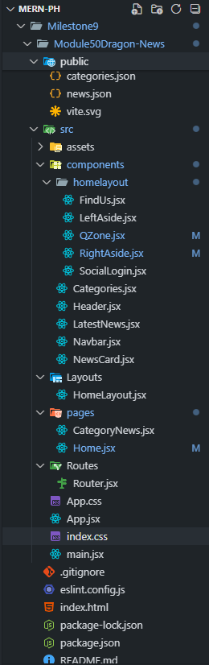
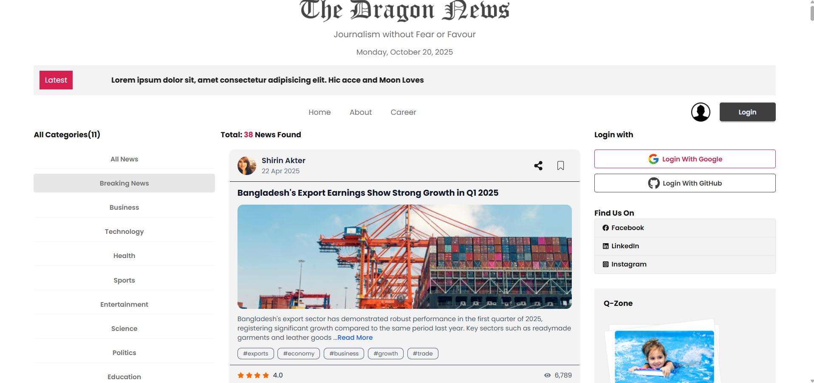
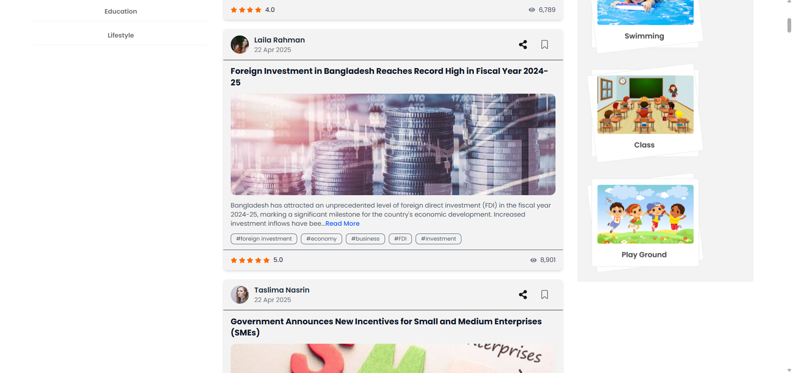

# 📰 Dragon News - Module 50 (React + Vite + Tailwind + DaisyUI)

A fully functional **React News Portal UI** built as part of **Milestone 9 (Module 50)**.  
This project demonstrates React Router, dynamic routes, JSON data rendering & a modular layout system —  designed with **TailwindCSS**, **DaisyUI** & **modern React best practices**.

---

## 🚀 Project Overview

Dragon News is a news platform interface inspired by real-world news portals. It features category-based filtering, modular layouts, reusable components & data-driven rendering using static JSON files (`news.json`, `categories.json`).

---

## 🧠 Core Concepts Covered

- **React Router v7.9** → Dynamic routes & loaders  
- **Vite** → Super fast development server  
- **TailwindCSS + DaisyUI** → Clean & modern UI design  
- **React Fast Marquee** → Smooth scrolling headlines  
- **React Icons** → Beautiful icons integration  
- **Date-fns** → Modern date formatting  
- **Suspense & use() hook** → Lazy loading categories  
- **Conditional rendering & filtering** → Custom logic for categories, today’s picks & all news

---

## 📁 Folder Structure



---

## 🚀 Key Features

* **Responsive Multi-Column Layout:** Implemented a standard newspaper layout with dedicated Left & Right sidebars alongside the main content area using **Tailwind CSS Grid**.

* **Dynamic Data Loading:** News data is loaded using **React Router's Loader** function for efficient pre-rendering.

* **Category-Based Routing:** Utilizes dynamic routing (`/category/:id`) to display news filtered by category ID.

* **Custom Filtering Logic:** Implements logic in `CategoryNews.jsx` to filter news based on the category ID, including special IDs for "All News" (ID 0) & "Today's Pick" (ID 1).

* **UI Frameworks:** Styled entirely with **Tailwind CSS** & **DaisyUI** components for rapid development.

* **Data Presentation:** Used **`react-fast-marquee`** for the "Latest News" ticker & **`date-fns`** for precise date formatting in the header.

* **Code Structure:** Follows a clean pattern with separate folders for **`Layouts`**, **`pages`**, **`Routes`** & **`components`**.

---

---

## 🧩 Key Components

| Component | Description |
|------------|--------------|
| **HomeLayout.jsx** | Defines main structure with Header, Navbar, LeftAside, RightAside |
| **NewsCard.jsx** | Displays individual news item with author, date, tags & rating |
| **CategoryNews.jsx** | Handles filtering logic & dynamic rendering by category ID |
| **Categories.jsx** | Fetches and lists all categories using the new React `use()` hook |
| **SocialLogin.jsx** | Placeholder for upcoming Firebase Authentication |
| **Header.jsx** | Displays logo and dynamic date via `date-fns` |
| **LatestNews.jsx** | Implements fast-moving marquee for headlines |

---


## 🧩 Core Files Overview

| File/Component | Purpose | Key Concept Demonstrated |
| :--- | :--- | :--- |
| **`Router.jsx`** | Defines all main routes, including nested routes for the Home Layout & placeholders for Auth/News. | Dynamic Route (`/category/:id`), **Loader Function**. |
| **`HomeLayout.jsx`** | Main structural component. Defines the Header, Navbar, Main Content (`<Outlet />`) & Left/Right Sidebars. | Nested Routing Layout, **`grid-cols-12`** structure. |
| **`CategoryNews.jsx`** | The main news display component. It uses **`useLoaderData`** & **`useParams`** to filter the loaded data based on the URL ID. | Data filtering logic, **`useEffect`** dependency management. |
| **`LeftAside.jsx`** | Displays news categories using the React **`use()`** hook & **`Suspense`** for asynchronous data fetching. | Asynchronous UI (Categories), Category Navigation. |
| **`NewsCard.jsx`** | Renders individual news items, including image, author info & dynamic rating/view counts. | Complex Component Structure, Date Formatting (`date-fns`). |
| **`SocialLogin.jsx`** (Right Aside) | Component with placeholder buttons for Google & GitHub—**ready for Firebase Auth integration in the next module.** | UI readiness for next Auth phase. |

---

## 🛠️ Technology Stack

| Technology | Role |
| :--- | :--- |
| **React (Vite)** | Core component-based UI library. |
| **Tailwind CSS** | Utility-first styling framework. |
| **DaisyUI** | Tailwind component library for rapid UI construction. |
| **react-router** | Handles SPA navigation, nested routes & data loaders. |
| **date-fns** | Library for reliable date formatting. |
| **react-fast-marquee** | Component for creating smooth news tickers. |

---

## ⚙️ Installation & Setup

```bash
# Clone this repository
git clone https://github.com/your-username/Dragon-News.git

# Navigate to the project folder
cd Module50Dragon-News

# Install dependencies
npm install

# Run the development server
npm run dev
```

`The application will typically open at http://localhost:5173.`

---

## 🌟 Features

- ✅ Dynamic category-based news filtering
- ✅ “Today’s Pick” news logic
- ✅ Modular layout structure
- ✅ Clean & responsive UI
- ✅ Marquee-based live headlines
- ✅ Ready for Firebase Authentication integration (Next Module)

---

📸 Preview




---

## 🏷️ License

### This project is not open-source.
### All rights reserved © Taoshif 2025.
