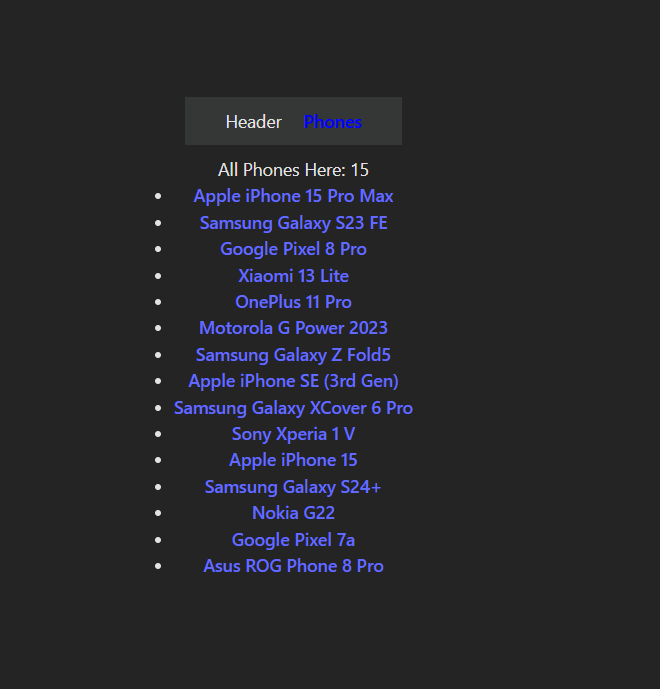
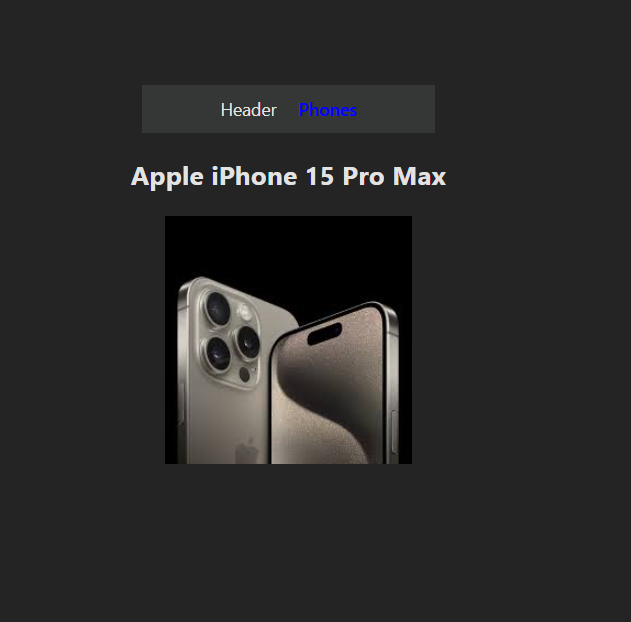

# 📱 MERN-PH: Express & React Phone Data Application

This project is a simple demonstration of connecting a **React frontend** using **React Router v6** with a custom **Express.js backend**. The backend serves a JSON dataset of 15 branded phone models, complete with live image links.

This project was built as a learning exercise for setting up the core structure of a MERN (Mongo-Express-React-Node) stack application.

***

## ✨ Features

* **Express Server:** Simple Node.js server built with Express to serve JSON data.
* **API Endpoint:** A `/phones` endpoint that serves all 15 phone data entries.
* **Data Structure:** JSON data includes `id`, `name`, `price`, `desc`, and a live `img` URL.
* **React Client:** Frontend built with Vite and React.
* **React Router v6:** Implements data loading using `loader` functions to fetch phone data before the component renders.

***

## 🛠️ Technologies Used

| Technology | Purpose |
| :--- | :--- |
| **Node.js** | JavaScript runtime environment for the server. |
| **Express.js** | Minimalist framework for building the server and APIs. |
| **React** | Frontend library for building the user interface. |
| **Vite** | Fast build tool for the React client. |
| **React Router DOM v6**| Handles client-side routing and data fetching (`loader`). |
| **Nodemon** | Used for automatically restarting the server on file changes during development. |

***

## 📚 Data Sample
The `/phones` endpoint returns an array of phone objects. The `/phones/:id` endpoint returns a single phone object with the following structure:

```json
{
  "id": 1,
  "name": "Apple iPhone 15 Pro Max",
  "price": 1199.00,
  "desc": "The ultimate flagship experience with a triple-lens camera and stunning OLED display. Features the A17 Bionic chip.",
  "img": "https://upload.wikimedia.org/wikipedia/commons/thumb/e/e9/IPhone_15_Pro_Max_Natural_Titanium.png/800px-IPhone_15_Pro_Max_Natural_Titanium.png"
}

```

***

## 🚀 Getting Started

Follow these steps to get the project running on your local machine.

### Prerequisites

You must have **Node.js** and **npm** (or yarn/pnpm) installed.

### 1. Clone the Repository

```bash
git clone [https://github.com/Taoshif1/MERN-PH.git](https://github.com/Taoshif1/MERN-PH.git)
cd MERN-PH
```
## 2. Install Dependencies

You will have separate dependencies for the server (Express) and the client (React).

#### Server Setup (Root Directory)

```bash
# Install Express and Nodemon (if used as dev dependency)
npm install express nodemon
```

### Client Setup (In the myfirstclient folder, based on your image)

```bash
# Navigate into your client directory
cd myfirstclient

# Install React dependencies (should include react-router-dom)
npm install
```

***

## 3. Running the Application
This project requires running both the server and the client simultaneously.

### A. Start the Express Server
In the root directory of your project:

```bash

# Start the server (assuming your script is configured for nodemon)
npm run server # or simply 'nodemon index.js' or your server file name
```
`You should see the message: My First Server Running on PORT: 5000.`

### B. Start the React Client

Navigate to the client directory (`myfirstclient`):

```bash

# Start the React client (Vite)
npm run dev
```

`The client will typically open in your browser at http://localhost:5173 (or similar).`

***

## 💡 How to Use the API

The Express server provides the following endpoints:

| Endpoint | Method | Description |
| :--- | :--- | :--- |
| `http://localhost:5000/` | `GET` | Home route. |
| `http://localhost:5000/phones` | `GET` | Retrieves the full list of 15 phones. |
| `http://localhost:5000/phones/:id` | `GET` | Retrieves a single phone by its unique ID (e.g., `/phones/3`). |

***

## 🖼️ Screenshot

