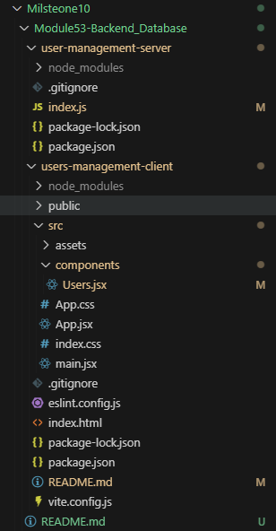
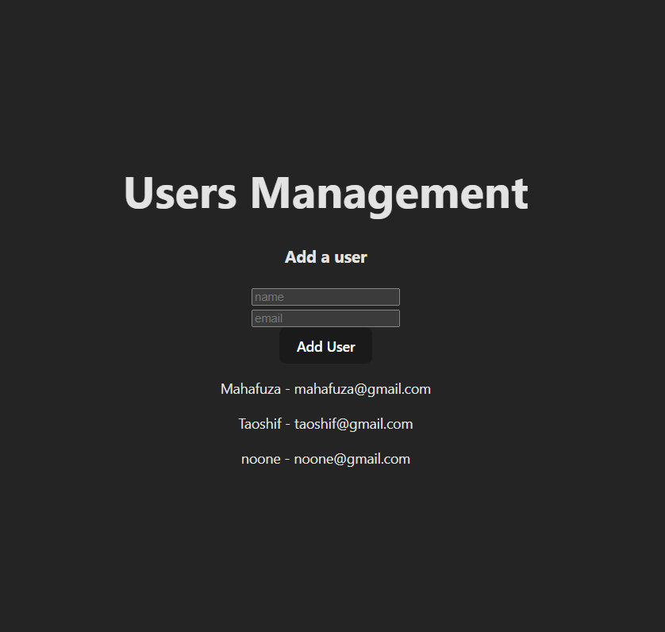
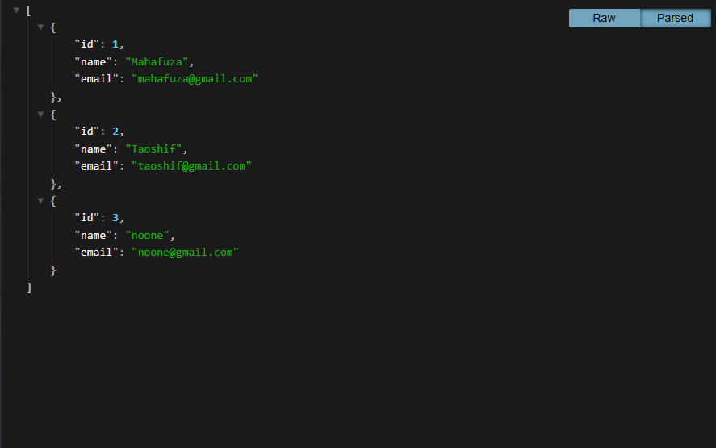
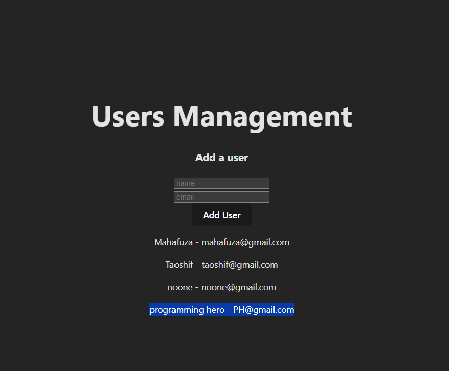
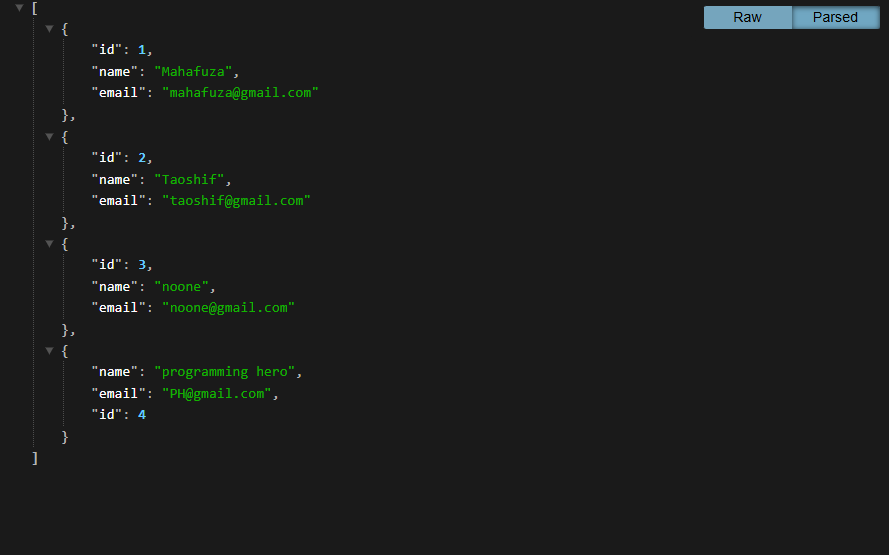

# 🧑‍💻 User Management System (Gettng started with `Node.js, Express & API`)

This project marks the start of **Milestone 10**, focusing on **Backend and Database Integration**. It establishes the core foundation of a **MERN stack application** by creating a basic server, defining API endpoints & implementing the first two CRUD operations (Read & Create) between the client (React) & the server (Node/Express).

## 🚀 Project Overview

This project marks the beginning of **Backend & Database Integration** in my full-stack journey.  
It demonstrates how the **frontend (client)** communicates with a **backend (server)** through **HTTP requests** using **fetch API**, **JSON** & **CORS**.

## 🚀 Key Achievements

* **RESTful API Setup (Node/Express):** Created a dedicated backend server capable of handling client requests.
* **CORS Configuration:** Used the `cors` middleware to allow the client (running on Vite/different port) to securely communicate with the server.
* **CRUD - Read (GET):** Implemented an API endpoint (`/users`) to successfully serve a list of users to the React client.
* **CRUD - Create (POST):** Implemented a **POST** endpoint to receive new user data from the client, add it to the server's data array & send back the newly created user object.
* **Client-Server Data Flow:** Successfully managed the data flow from the client form (in `Users.jsx`) to the server and back, dynamically updating the client's UI state.
* **Express Middleware:** Used `express.json()` to parse incoming JSON data from the client's **POST** request body, making it accessible via `req.body`.

---

## 🛠️ Technology Stack

| Component | Technology | Role |
| :--- | :--- | :--- |
| **Backend (Server)** | **Node.js** | JavaScript Runtime Environment. |
| **Framework** | **Express.js (5.1.0)** | Minimalist web application framework for API creation. |
| **Middleware** | **CORS** | Enables Cross-Origin Resource Sharing. |
| **Frontend (Client)** | **React (Vite)** | UI library for user interaction. |
| **Client Fetching** | **Native Fetch API** | Used in React to communicate with the server. |

---

## 📁 Project Structure

This project is organized into two separate folders: `user-management-server` and `users-management-client`, reflecting the standard full-stack deployment model.



---

## ✅ Server Features:

1. Built with `Express.js`

2. Handles both `GET` and `POST` requests

3. Returns JSON responses

4. Uses CORS middleware to allow cross-origin communication

5. Ready to connect to a real database (MongoDB in the next module)

## ✅ Client Features:

1. Fetches all users from /users API

2. Displays them dynamically

3. Allows adding new users through POST requests

4. Uses fetch() for REST API communication

5. Demonstrates how to sync state (useState) with backend data

---

## 🌟 Features Summary

1. ✅ RESTful API setup with Node.js & Express

2. ✅ Frontend–Backend communication with Fetch

3. ✅ Dynamic rendering of user data

4. ✅ CORS-enabled API access

5. ✅ Middleware integration (express.json())

6. ✅ State management with React Hooks

7. ✅ Nodemon-enabled live server reload

---

## 📝 API Endpoints

| Method | Endpoint | Description |
| :--- | :--- | :--- |
| **GET** | `/` | Checks server availability (`'user server is available'`). |
| **GET** | `/users` | Retrieves the entire array of user objects. |
| **POST** | `/users` | Receives new user data (name, email), assigns a temporary ID, and adds it to the list. |

---

## ⚙️ Installation & Setup

### **1. Clone the Repository**

Clone the project and navigate to the root directory.

### **2. Start the Backend Server**

Navigate to the server directory and install dependencies, then start the server.

```bash
cd user-management-server
npm install
npm start 
# Server runs on http://localhost:3000
```
(The console should log: `user server started on PORT 3000`)

### 3. Start the Frontend Client

Open a second terminal, navigate to the client directory, install dependencies, and start the client.

```bash

cd users-management-client
npm install
npm run dev
# Client runs on http://localhost:5173 (or similar)
```

---

📸 Preview

1. Font-End


2. Back-End


After adding another user ->

1. Font-End


2. Back-End


---

## 🏷️ License

This project is for educational purposes & not free.
© 2025 — Taoshif | Milestone 10 - Backend & Database Integration