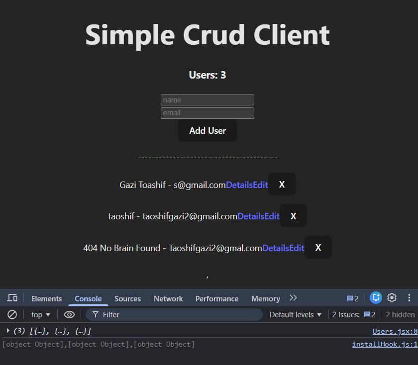
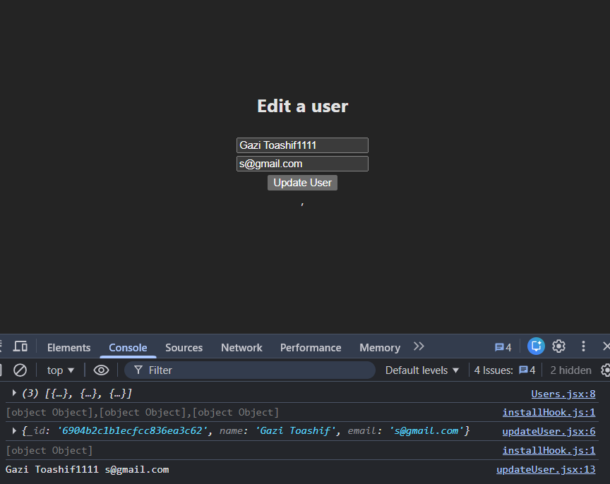

# 🧠 Node + Express + MongoDB CRUD (Module 54)

A simple yet powerful CRUD Application built using Node.js, Express, MongoDB, and React.js.
This project demonstrates how to connect the backend with a cloud database (MongoDB Atlas), and perform Create, Read, Update, Delete operations seamlessly.

**

# 🚀 Features

- ✅ RESTful API with Express
- ✅ MongoDB Atlas connection with Mongoose driver
- ✅ Basic CRUD Operations
- ✅ React Frontend integrated with the API
- ✅ Dynamic routing using React Router
- ✅ Real-time user addition and deletion from the database
- ✅ Modular, clean structure — perfect for beginners learning MERN

**

# 🛠️ Technology Stack

Component,Technology,Role
Database,MongoDB Atlas,Cloud database for storing user data.
Backend,"Node.js, Express.js",The server environment and REST API foundation.
API/DB Driver,mongodb package,Connects Express to MongoDB and handles queries.
Frontend,React (Vite),The user interface for interaction.
Routing,React Router DOM,Handles client-side navigation and data fetching via loader.

**

# ⚙️ Project Structure

```pgsql
📦 simple-crud-mern
 ┣ 📂 server
 ┃ ┣ 📜 index.js
 ┃ ┗ 📜 package.json
 ┣ 📂 client
 ┃ ┣ 📂 src
 ┃ ┃ ┣ 📜 App.jsx
 ┃ ┃ ┣ 📜 main.jsx
 ┃ ┃ ┣ 📜 components/
 ┃ ┃ ┃ ┣ 📜 Users.jsx
 ┃ ┃ ┃ ┣ 📜 userDetail.jsx
 ┃ ┃ ┃ ┗ 📜 updateUser.jsx
 ┃ ┗ 📜 package.json
 ┗ 📜 README.md
```
**

# 🔧 Backend Setup (Server)

## 1️⃣ Install dependencies

```bash
npm install
```
## 2️⃣ Run the server

```bash
node index.js
```

## 3️⃣ MongoDB Setup

- Create a MongoDB Atlas cluster

- Replace your connection URI in index.js

```js
const uri = "mongodb+srv://<username>:<password>@cluster0.mongodb.net/?appName=Cluster0";
```

## 4️⃣ Available Routes

| Method | Route        | Description                       |
| ------ | ------------ | --------------------------------- |
| GET    | `/`          | Home route (server running check) |
| GET    | `/users`     | Fetch all users                   |
| GET    | `/users/:id` | Fetch user by ID                  |
| POST   | `/users`     | Create new user                   |
| PATCH  | `/users/:id` | Update existing user              |
| DELETE | `/users/:id` | Delete user by ID                 |

**

# 💻 Frontend Setup (Client)

## 1️⃣ Install dependencies

```bash
npm install
```

## 2️⃣ Run the client


```bash
npm run dev
```

## 3️⃣ React Routes

| Route         | Component      | Description                |
| ------------- | -------------- | -------------------------- |
| `/`           | App.jsx        | Home page displaying users |
| `/users/:id`  | userDetail.jsx | Shows user details         |
| `/update/:id` | updateUser.jsx | Edit existing user info    |

** 

# 📸 Screenshots




**

# 🧩 CRUD Workflow

- 1️⃣ Read – Fetch all users from MongoDB Atlas
- 2️⃣ Create – Add new users via POST request
- 3️⃣ Update – Edit user data with PATCH
- 4️⃣ Delete – Remove user via DELETE endpoint

**

## 🧠 Learnings from Module 54

* How to connect **MongoDB Atlas** using `MongoClient`.
* How to build a **RESTful API** with Express.
* How to use `fetch()` to connect frontend and backend.
* How to perform **full CRUD** from React UI.

---

## 🏁 Future Improvements

* 🚀 Add **Mongoose** for schema validation.
* 🔐 Add **environment variables** for security.
* 🎨 Add **TailwindCSS** for UI styling.
* 🌍 Deploy on **Vercel** (frontend) & **Render** (backend).

---

## 👨‍💻 Author

**Taoshif (Taoshiflex)**
* 🎯 CSE Student | 💡 MERN Learner | 🚀 Future Tech Entrepreneur
* 📍 East West University, Dhaka