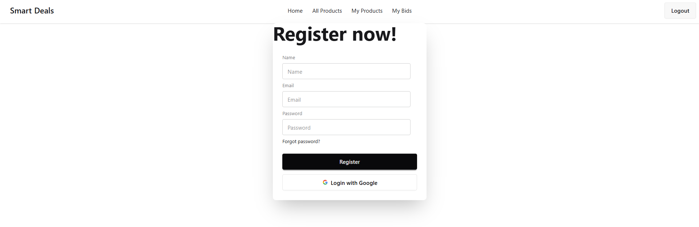

# 🚀 Smart Deals 

<div align="center">


**A Modern Bidding & Deals Platform Built with Passion 💙**


</div>

---

## 📖 Table of Contents

- [Overview](#-overview)
- [Features](#-features)
- [Tech Stack](#-tech-stack)
- [Project Structure](#-project-structure)
- [Getting Started](#-getting-started)
- [API Documentation](#-api-documentation)
- [Database Schema](#-database-schema)
- [Screenshots](#-screenshots)
- [Learning Journey](#-learning-journey)
- [Future Enhancements](#-future-enhancements)
- [Contributing](#-contributing)
- [License](#-license)
- [Contact](#-contact)

---

## 🎯 Overview

**Smart Deals** is a full-stack marketplace application where users can list products, place bids, and manage their deals seamlessly. Built as part of my MERN Stack learning journey (Milestone 10, Module 55), this project demonstrates my growing expertise in modern web development technologies and my passion for creating intuitive, real-world applications.

### 🌟 What Makes This Project Special?

- **Real-world Application**: Solves actual marketplace needs with bidding functionality
- **Modern Architecture**: RESTful API design with proper separation of concerns
- **Secure Authentication**: Firebase integration for robust user management
- **Responsive Design**: Mobile-first approach using TailwindCSS & DaisyUI
- **Clean Code**: Well-structured, maintainable, and documented codebase
- **Professional Development Practices**: Environment variables, error handling, and code organization

---

## ✨ Features

### 🔐 Authentication & Authorization
- Google OAuth integration via Firebase
- Protected routes for authenticated users
- User session management with persistent login
- Automatic user profile creation in MongoDB

### 📦 Product Management
- **Create Listings**: Post products with detailed information
- **Browse Products**: View all available deals
- **My Products**: Manage your posted items
- **Product Details**: Comprehensive product information display
- **Update & Delete**: Full CRUD operations on your listings

### 💰 Bidding System
- **Place Bids**: Make offers on products you're interested in
- **My Bids**: Track all your placed bids
- **Bid Status**: Monitor bid acceptance/rejection
- **Email Filtering**: View bids specific to your account

### 🎨 User Interface
- Clean and modern design with DaisyUI components
- Responsive navigation with mobile menu
- Conditional rendering based on authentication state
- Smooth user experience with React Router

---

## 🛠️ Tech Stack

### Frontend
- **React 19.1.1** - Modern UI library with hooks
- **React Router 7.9.5** - Client-side routing
- **TailwindCSS 4.1.16** - Utility-first CSS framework
- **DaisyUI 5.3.10** - Tailwind component library
- **Vite 7.1.7** - Lightning-fast build tool
- **Firebase 12.5.0** - Authentication & backend services

### Backend
- **Node.js** - JavaScript runtime
- **Express.js** - Web application framework
- **MongoDB Atlas** - Cloud database
- **MongoDB Driver** - Official MongoDB Node.js driver
- **CORS** - Cross-origin resource sharing

### Development Tools
- **ESLint** - Code linting
- **Vite Plugin React** - Fast refresh & JSX support

---

## 📁 Project Structure
```
smart-deals/
│
├── smart-deals-client/          # Frontend React Application
│   ├── src/
│   │   ├── components/
│   │   │   ├── AllProducts/     # Browse all products
│   │   │   ├── Home/            # Landing page
│   │   │   ├── MyBids/          # User's bids management
│   │   │   ├── MyProducts/      # User's products management
│   │   │   ├── Navbar/          # Navigation component
│   │   │   └── Register/        # Authentication page
│   │   ├── context/
│   │   │   ├── AuthContext.js   # Auth context definition
│   │   │   └── AuthProvider.jsx # Auth state management
│   │   ├── firebase/
│   │   │   └── firebase.init.js # Firebase configuration
│   │   ├── layouts/
│   │   │   └── RootLayout.jsx   # Main layout wrapper
│   │   ├── App.jsx              # Root component
│   │   ├── main.jsx             # Entry point
│   │   └── index.css            # Global styles
│   ├── package.json
│   ├── vite.config.js
│   └── README.md
│
└── smart-deals-server/          # Backend Express Application
    ├── index.js                 # Main server file
    ├── package.json
    └── README.md
```

---

## 🚀 Getting Started

### Prerequisites

- **Node.js** (v16 or higher)
- **MongoDB Atlas** account
- **Firebase** project setup
- **npm** or **yarn** package manager

### Installation

#### 1️⃣ Clone the Repository
```bash
git clone https://github.com/yourusername/smart-deals.git
cd smart-deals
```

#### 2️⃣ Backend Setup
```bash
cd smart-deals-server
npm install

# Create .env file (recommended)
# Add your MongoDB URI
MONGODB_URI=mongodb+srv://your-credentials

# Start the server
npm start
```

Server will run on `http://localhost:3000`

#### 3️⃣ Frontend Setup
```bash
cd smart-deals-client
npm install

# Create firebase.init.js with your config
# (Already included in the project)

# Start development server
npm run dev
```

Client will run on `http://localhost:5173`

### Environment Variables

**Backend (.env)** - Recommended:
```env
PORT=3000
MONGODB_URI=your_mongodb_connection_string
```

**Frontend (firebase.init.js)**:
```javascript
const firebaseConfig = {
  apiKey: "your_api_key",
  authDomain: "your_auth_domain",
  projectId: "your_project_id",
  // ... other config
};
```

---

## 📡 API Documentation

### Base URL
```
http://localhost:3000
```

### Endpoints

#### 🔹 Root
```http
GET /
Response: "Smart Deals Server"
```

#### 🔹 Users

| Method | Endpoint | Description | Auth Required |
|--------|----------|-------------|---------------|
| POST | `/users` | Create new user (checks for existing email) | No |

**Request Body:**
```json
{
  "name": "John Doe",
  "email": "john@example.com",
  "image": "https://photo-url.com"
}
```

#### 🔹 Products

| Method | Endpoint | Description | Auth Required |
|--------|----------|-------------|---------------|
| GET | `/products` | Get all products (optional email filter) | No |
| GET | `/products/:id` | Get single product by ID | No |
| POST | `/products` | Create new product | Yes |
| PATCH | `/products/:id` | Update product | Yes |
| DELETE | `/products/:id` | Delete product | Yes |

**Query Parameters:**
- `email` - Filter products by seller email

**Product Object:**
```json
{
  "title": "iPhone 13 Pro",
  "price_min": 600,
  "price_max": 800,
  "email": "seller@example.com",
  "category": "Electronics",
  "image": "https://image-url.com",
  "status": "pending",
  "location": "Dhaka",
  "seller_image": "https://seller-photo.com",
  "seller_name": "John Seller",
  "condition": "used",
  "usage": "6 months",
  "description": "Excellent condition...",
  "seller_contact": "+880123456789"
}
```

#### 🔹 Bids

| Method | Endpoint | Description | Auth Required |
|--------|----------|-------------|---------------|
| GET | `/bids` | Get all bids (optional email filter) | Yes |
| POST | `/bids` | Place new bid | Yes |

**Query Parameters:**
- `email` - Filter bids by buyer email

**Bid Object:**
```json
{
  "product_id": "507f1f77bcf86cd799439011",
  "buyer_name": "Jane Buyer",
  "buyer_email": "jane@example.com",
  "buyer_image": "https://photo.com",
  "buyer_contact": "+880123456789",
  "bid_price": 650,
  "status": "pending"
}
```

---

## 🗄️ Database Schema

### Collections

#### Products Collection
```javascript
{
  _id: ObjectId,
  title: String,
  price_min: Number,
  price_max: Number,
  email: String,          // Seller email
  category: String,
  created_at: ISODate,
  image: String,
  status: String,         // "pending" | "sold"
  location: String,
  seller_image: String,
  seller_name: String,
  condition: String,      // "fresh" | "used"
  usage: String,
  description: String,
  seller_contact: String
}
```

#### Bids Collection
```javascript
{
  _id: ObjectId,
  product_id: ObjectId,   // Reference to Products
  buyer_image: String,
  buyer_name: String,
  buyer_contact: String,
  buyer_email: String,
  bid_price: Number,
  status: String          // "pending" | "confirmed"
}
```

#### Users Collection
```javascript
{
  _id: ObjectId,
  name: String,
  email: String,          // Unique
  image: String
}
```

---

## 📸 Screenshots

> 

---

## 📚 Learning Journey

This project represents **Module 55** of my **MERN Stack Development Course (Milestone 10)**. Through building Smart Deals, I've gained hands-on experience with:

### Backend Development
- ✅ Setting up Express.js server with proper middleware
- ✅ MongoDB Atlas integration and cloud database management
- ✅ Designing RESTful API endpoints
- ✅ Implementing CRUD operations with MongoDB
- ✅ Query filtering and data retrieval optimization
- ✅ Error handling and server-side validation

### Frontend Development
- ✅ Building React applications with modern hooks (useState, useEffect)
- ✅ Context API for global state management
- ✅ React Router for client-side navigation
- ✅ Firebase Authentication integration
- ✅ Conditional rendering based on auth state
- ✅ Component composition and reusability

### Full Stack Integration
- ✅ Connecting frontend to backend APIs
- ✅ Handling asynchronous operations with fetch
- ✅ Managing user sessions across client and server
- ✅ CORS configuration for cross-origin requests

### Professional Practices
- ✅ Code organization and project structure
- ✅ Environment variable management
- ✅ Git version control
- ✅ Documentation and README creation

---

## 🔮 Future Enhancements

### Phase 1 (Current Module Extensions)
- [ ] **Private Route Protection** - Implement protected routes for authenticated pages
- [ ] **Product Detail Page** - Dedicated page for viewing full product details
- [ ] **Bid Management** - Accept/reject bids functionality for sellers
- [ ] **Search & Filter** - Advanced product search and category filtering

### Phase 2 (Next Steps)
- [ ] **Image Upload** - Integrate cloud storage (Cloudinary/AWS S3)
- [ ] **Real-time Notifications** - Socket.io for bid updates
- [ ] **User Profiles** - Detailed seller/buyer profiles with ratings
- [ ] **Payment Integration** - Stripe/PayPal for secure transactions
- [ ] **Chat System** - Direct messaging between buyers and sellers

### Phase 3 (Advanced Features)
- [ ] **Admin Dashboard** - Platform management and moderation
- [ ] **Analytics** - Sales and bidding statistics
- [ ] **Email Notifications** - Automated bid and sale alerts
- [ ] **Mobile App** - React Native version
- [ ] **Multi-language Support** - i18n integration

---

## 🤝 Contributing

Contributions, issues, and feature requests are welcome! This is a learning project, and I'm open to feedback and collaboration.

### How to Contribute
1. Fork the project
2. Create your feature branch (`git checkout -b feature/AmazingFeature`)
3. Commit your changes (`git commit -m 'Add some AmazingFeature'`)
4. Push to the branch (`git push origin feature/AmazingFeature`)
5. Open a Pull Request

---

## 📄 License

This project is **not open source** & not available for learning purposes. Contact me before using it.


---
## 🎓 Acknowledgments

- **Programming Hero** - For the comprehensive MERN Stack course
- **MongoDB** - For database management insights
- **Firebase** - For simplified authentication
- **React Documentation** - For excellent learning resources
- **Stack Overflow Community** - For problem-solving support

---

<div align="center">

### 💙 Built with Passion & Dedication

**Learning • Building • Growing**

*Part of my journey to becoming a Full Stack Developer*

---


⭐ **Star this repo if you find it helpful!** ⭐

*Last Updated: November 2025*


---


**[⬆ Back to Top](#-smart-deals)**

</div>