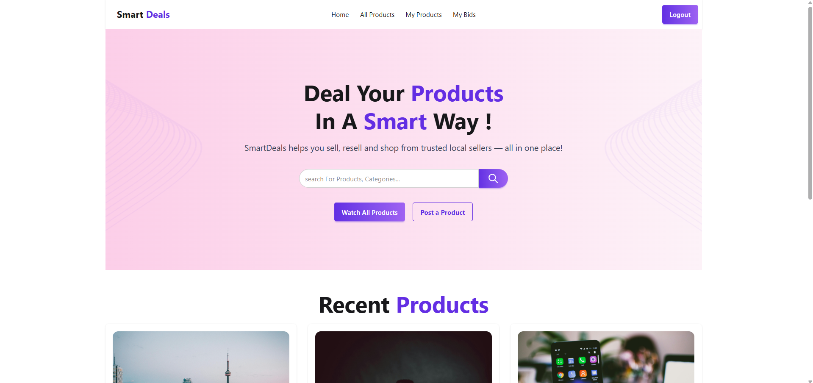
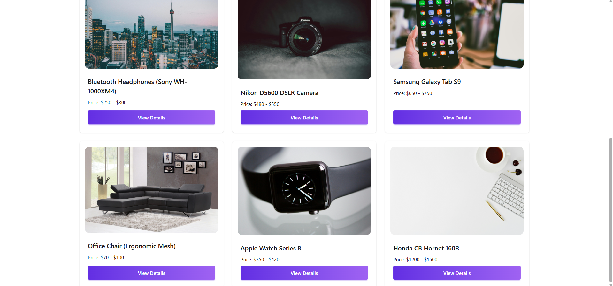
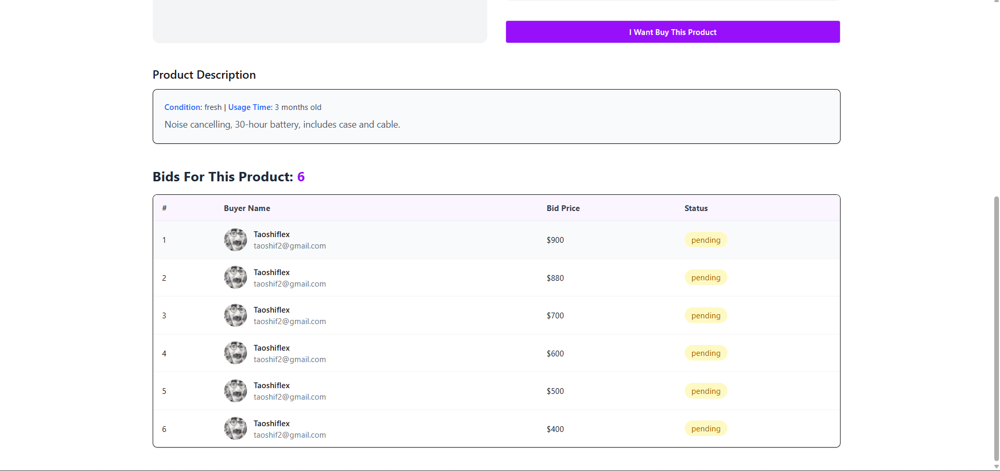
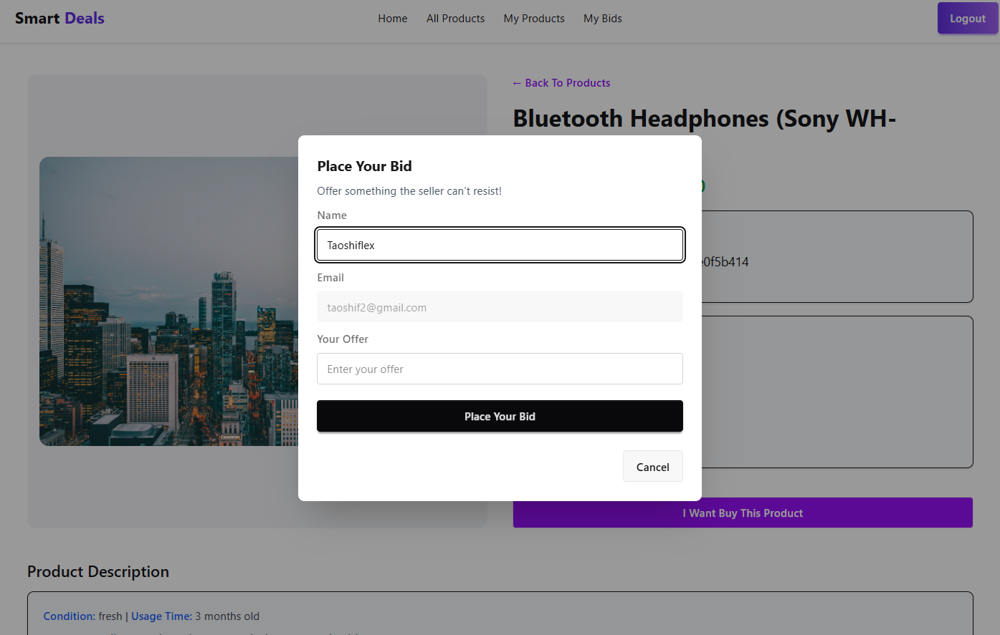

# SmartDeals Part 2

A modern, full-stack marketplace platform where users can sell, resell & shop from trusted local sellers. Built with React, Express, MongoDB & Firebase Authentication.

# 🌟 Features


## 🔐 Authentication

- Google OAuth Integration - Seamless sign-in with Google
- Firebase Authentication - Secure user management
- Protected Routes - Private routes for authenticated users only
- Persistent Sessions - Auto-login on page refresh

## 🛍️ Product Management

- Product Listings - Browse all available products
- Latest Products - View 6 most recent additions on homepage
- Product Details - Comprehensive product information with seller details
- My Products - Manage your own product listings
- Advanced Sorting - Price-based and date-based sorting

## 💰 Bidding System

-Place Bids - Make offers on products you're interested in
- My Bids - Track all your active bids
- Bid Management - Remove bids with confirmation dialogs
- Real-time Updates - Automatic bid list updates
- Bid Status - Track pending, accepted, and rejected bids
- Product-specific Bids - View all bids on individual products

## 🎨 User Interface

- Responsive Design - Mobile-first approach with TailwindCSS
- DaisyUI Components - Pre-built, customizable UI components
- Loading States - Suspense-based loading indicators
- Custom Theming - Purple gradient primary color scheme
- Sweet Alerts - Beautiful confirmation and notification dialogs
- Hero Section - Eye-catching landing page with search functionality

## 🔄 Data Relations

- User-Product Relationship - Products linked to sellers
- Product-Bid Relationship - Multiple bids per product
- User-Bid Relationship - Track user bidding history
- Data Merging - Frontend joins for complete information display


# 🚀 Tech Stack

## Frontend

- React 19.1.1 - Latest React with modern hooks
- React Router 7.9.5 - Client-side routing with loaders
- TailwindCSS 4.1.16 - Utility-first CSS framework
- DaisyUI 5.3.10 - Component library
- Firebase 12.5.0 - Authentication & user management
- SweetAlert2 11.26.3 - Beautiful alerts and modals
- Vite 7.1.7 - Fast build tool and dev server

## Backend

- Node.js - JavaScript runtime
- Express 5.1.0 - Web application framework
- MongoDB 6.20.0 - NoSQL database
- CORS - Cross-origin resource sharing
- dotenv - Environment variable management


# 🛠️ Installation

## 1. Clone the Repository
```bash
git clone https://github.com/yourusername/smart-deals.git
cd smart-deals
```

## 2. Backend Setup
```bash 
cd smart-deals-server
npm install
```
### Create a .env file in the server root:
```env
DB_USER=your_mongodb_username
DB_PASS=your_mongodb_password
PORT=3000
```
## MongoDB Setup:

- Create a MongoDB Atlas account at https://www.mongodb.com/cloud/atlas
- Create a new cluster
- Create a database user with username and password
- Get your connection string and update .env file

## Start the server:
```bash
npm start
```
`The server will run on http://localhost:3000`

## 3. Frontend Setup
```bash
cd smart-deals-client
npm install
```
Create a `.env` file in the client root:

```env
VITE_APIKEY=your_firebase_api_key
VITE_AUTHDOMAIN=your_firebase_auth_domain
VITE_PROJECTID=your_firebase_project_id
VITE_STORAGEBUCKET=your_firebase_storage_bucket
VITE_MESSAGINGSENDERID=your_firebase_messaging_sender_id
VITE_APPID=your_firebase_app_id
```

## Firebase Setup:

1. Go to https://console.firebase.google.com/
2. Create a new project
3. Enable Google Authentication:
    - Go to Authentication → Sign-in method
    - Enable Google provider

4. Go to Project Settings → General
5. Scroll to "Your apps" → Web app
6. Copy the config values to your .env file

# Start the development server:
```bash
npm run dev
```

The app will run on `http://localhost:5173`

## 📁 Project Structure

### Frontend Structure
```
smart-deals-client/
├── src/
│   ├── assets/          # Images and static files
│   ├── components/      # React components
│   │   ├── AllProducts/
│   │   ├── HeroSection/
│   │   ├── Home/
│   │   ├── LatestProducts/
│   │   ├── LoadingSpinner/
│   │   ├── MyBids/
│   │   ├── MyProducts/
│   │   ├── Navbar/
│   │   ├── Product/
│   │   ├── ProductDetails/
│   │   └── Register/
│   ├── context/         # React Context API
│   │   ├── AuthContext.jsx
│   │   └── AuthProvider.jsx
│   ├── firebase/        # Firebase configuration
│   │   └── firebase.init.js
│   ├── layouts/         # Layout components
│   │   └── RootLayout.jsx
│   ├── routes/          # Route protection
│   │   └── PrivateRoute.jsx
│   ├── App.jsx
│   ├── main.jsx
│   └── index.css
├── .env
├── package.json
└── vite.config.js
```

### Backend Structure
```
smart-deals-server/
├── index.js            # Main server file
├── .env                # Environment variables
├── .gitignore
└── package.json

```

# 🔑 API Endpoints

## Users

| Method | Endpoint | Description |
|--------|----------|-------------|
| POST | `/users` | Create new user (checks for existing email) |

## Products

| Method | Endpoint | Description |
|--------|----------|-------------|
| GET | `/products` | Get all products (supports email query) |
| GET | `/latest-products` | Get 6 most recent products |
| GET | `/products/:id` | Get single product by ID |
| POST | `/products` | Create new product |
| PATCH | `/products/:id` | Update product |
| DELETE | `/products/:id` | Delete product |

## Bids

| Method | Endpoint | Description |
|--------|----------|-------------|
| GET | `/bids?email=user@email.com` | Get bids by buyer email |
| GET | `/products/bids/:productId` | Get all bids for a product (sorted by price) |
| POST | `/bids` | Create new bid |
| DELETE | `/bids/:id` | Delete bid |


# 💾 Database Schema

## Collections

```js
// users
  _id: ObjectId,
  name: String,
  email: String,
  image: String

//products
  _id: String,
  title: String,
  price_min: Number,
  price_max: Number,
  image: String,
  seller_name: String,
  seller_image: String,
  seller_contact: String,
  email: String,
  location: String,
  condition: String,
  usage: String,
  description: String,
  status: String,
  created_at: Date

// bids
  _id: ObjectId,
  product: String,          // Product ID reference
  buyer_name: String,
  buyer_email: String,
  buyer_image: String,
  bid_price: Number,
  status: String           // "pending", "accepted", "rejected"
```

# 🎯 Key Features Explained

## 1. Authentication Flow

- User clicks "Login with Google"
- Firebase handles OAuth
- User data saved to MongoDB (if new)
- JWT token stored in Firebase
- Protected routes check authentication state

## 2. Bidding System

- Users browse products
- Click "I Want Buy This Product"
- Enter bid amount in modal
- Bid saved to database
- Appears in "My Bids" section
- Seller can see all bids on their products

## 3. Data Relations

Products and bids are related through the `product` field in bids collection:
```javascript
// Frontend merges data from both collections
const merged = bidsData.map((bid) => {
  const product = products.find((p) => p._id === bid.product);
  return { ...bid, ...productInfo };
});
```

## 4. Real-time Updates

- Optimistic UI updates after bid placement
- Immediate removal from UI after deletion
- SweetAlert2 confirmations for destructive actions

# 🎨 Custom Styling

## Theme Configuration
```css
@plugin "daisyui/theme" {
  name: "light";
  default: true;
  --color-primary: #632EE3;
  --color-secondary: teal;
}
```

## Custom Button Gradients
```css
.btn-primary {
  @apply bg-gradient-to-r from-[#632EE3] to-[#9F62F2] border-none text-white;
}
```

# 🔒 Security Features

- **Environment Variables** - Sensitive data in .env files
- **Firebase Security Rules** - Server-side validation
- **Protected Routes** - Authentication required for sensitive pages
- **CORS Configuration** - Controlled cross-origin requests
- **Input Validation** - Form validation on client and server

# 🚀 Deployment

## Frontend (Netlify/Vercel)
```bash
npm run build
# Upload dist folder to hosting service
```

## Backend (Render/Railway/Heroku)
```bash
# Set environment variables in hosting dashboard
# Deploy from GitHub repository
```

## Environment Variables Checklist

- [ ] MongoDB connection string
- [ ] Firebase configuration (6 variables)
- [ ] PORT configuration
- [ ] Update API URLs from localhost to production

# 📝 Usage Guide

## For Buyers

1. Sign in with Google
2. Browse products on home page or "All Products"
3. Click product to view details
4. Place your bid with desired amount
5. Track bids in "My Bids" section
6. Remove bids if needed

## For Sellers

1. Sign in with Google
2. Post products (feature in development)
3. View bids on your products
4. Accept/Reject bids (feature in development)
5. Manage products in "My Products"

# 🐛 Known Issues & Limitations

- My Products page not fully implemented
- No bid acceptance/rejection feature yet
- Search functionality on hero section not connected
- No pagination for product lists
- No image upload feature
- No product editing interface
- No seller dashboard

# 🔮 Future Enhancements

- [ ] Complete seller dashboard
- [ ] Bid acceptance/rejection system
- [ ] Real-time notifications
- [ ] Image upload for products
- [ ] Advanced search and filters
- [ ] Product categories
- [ ] User ratings and reviews
- [ ] Chat system between buyers and sellers
- [ ] Payment integration
- [ ] Email notifications
- [ ] Product image gallery
- [ ] Wishlist feature
- [ ] Pagination and infinite scroll

## Site SS





