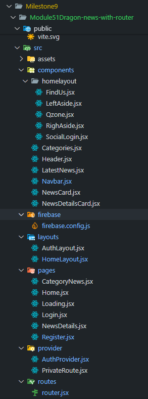

# 🐉 Dragon News — React + Firebase Authentication + Router

A fully responsive, modern **news portal web app** built with **React 19**, **React Router 7**, **Firebase Authentication** & **TailwindCSS + DaisyUI**. 

---

## 🌐 Live Project

🔗 **Website URL:** [Dragon News Web App](https://dragon-news-cfab2.web.app)

---

## ✨ Features

✅ **Authentication System**
- Firebase Email + Password Auth
- Register, Login & Logout functionality
- Protected route for viewing detailed news (`PrivateRoute`)

✅ **Routing & Layouts**
- Nested routes using React Router v7
- `HomeLayout` for main layout (Header, Navbar, Asides)
- `AuthLayout` for Auth pages (Login / Register)
- `PrivateRoute` to protect `/news-details/:id`

✅ **UI/UX**
- Fully responsive layout
- Modern & minimal design using **TailwindCSS + DaisyUI**
- Smooth animations & loading states

✅ **Data Handling**
- Dynamic category filtering via `categories.json`
- Data loaded from `news.json`
- News detail view with share, rating & author info

✅ **Extras**
- `React Fast Marquee` for Latest News
- `date-fns` for elegant date formatting
- `React Icons` integration

---

## 📂 Project Structure



---

## ⚙️ Tech Stack

| Category | Tech |
|-----------|------|
| Frontend Framework | React 19 |
| Routing | React Router v7 |
| Authentication | Firebase Auth |
| Styling | Tailwind CSS + DaisyUI |
| Hosting | Firebase Hosting |
| Icons | React Icons |
| Date Formatting | date-fns |
| Animations | react-fast-marquee |

---

## 🧠 Key Components Breakdown

| Component | Responsibility |
|------------|----------------|
| **Root.jsx** | Parent layout containing Navbar + `<Outlet />` for child routes |
| **Navbar.jsx** | Responsive navigation bar with user info + auth buttons |
| **Register.jsx** | Handles new user creation, validation & profile update |
| **Login.jsx** | Handles user login + redirects + error handling |
| **HomeLayout.jsx** | Core layout with header, left/right aside & outlet |
| **PrivateRoute.jsx** | Guards restricted pages (e.g., NewsDetails) |
| **firebase.config.js** | Firebase initialization |
| **info.js** | (Optional) Developer notes/documentation |

---

## 🔥 Firebase Setup

1. Create a new Firebase project at [Firebase Console](https://console.firebase.google.com)
2. Enable **Email/Password Authentication**
3. Add your Firebase config to `.env`:

```bash
VITE_apiKey=your_api_key
VITE_authDomain=your_auth_domain
VITE_projectId=your_project_id
VITE_storageBucket=your_storage_bucket
VITE_messagingSenderId=your_sender_id
VITE_appId=your_app_id
```

4. Run locally:

```bash
npm install
npm run dev
```
---

## 🧩 Data Files

categories.json

```json
[
  { "id": 0, "name": "All News" }
]
```

news.json

```json
{
  "id": "bcdefa0123456789bcdefa01",
  "category_id": 2,
  "title": "Bangladesh's Export Earnings Show Strong Growth in Q1 2025",
  "rating": { "number": 4, "badge": "trending" },
  "total_view": 6789,
  "author": {
    "name": "Shirin Akter",
    "published_date": "2025-04-22T17:00:00.000Z",
    "img": "https://randomuser.me/api/portraits/women/29.jpg"
  },
  "thumbnail_url": "https://apparelresources.com/wp-content/uploads/2024/11/Bangladeshs-RMG-exports-decline-by-2.8-per-cent-in-FY-25-Q1-.jpg",
  "details": "Bangladesh's export sector has demonstrated robust performance...",
  "tags": ["exports", "economy", "business", "growth", "trade"],
  "others": { "is_today_pick": true, "is_trending": true },
  "production": true
}
```

## 🚀 Deployment

Deployed on Firebase Hosting

```bash
npm run build
firebase deploy
```
---

## 👨‍💻 Developer

### 👑 Taoshif
### 📍 East West University, Dhaka
### 💼 Aspiring Entrepreneur & CSE Student

---

## 📜 License

### This project is not open-source under the MIT License

---

# 💬 Built with passion, designed with precision — Dragon News delivers stories with fire. 🔥